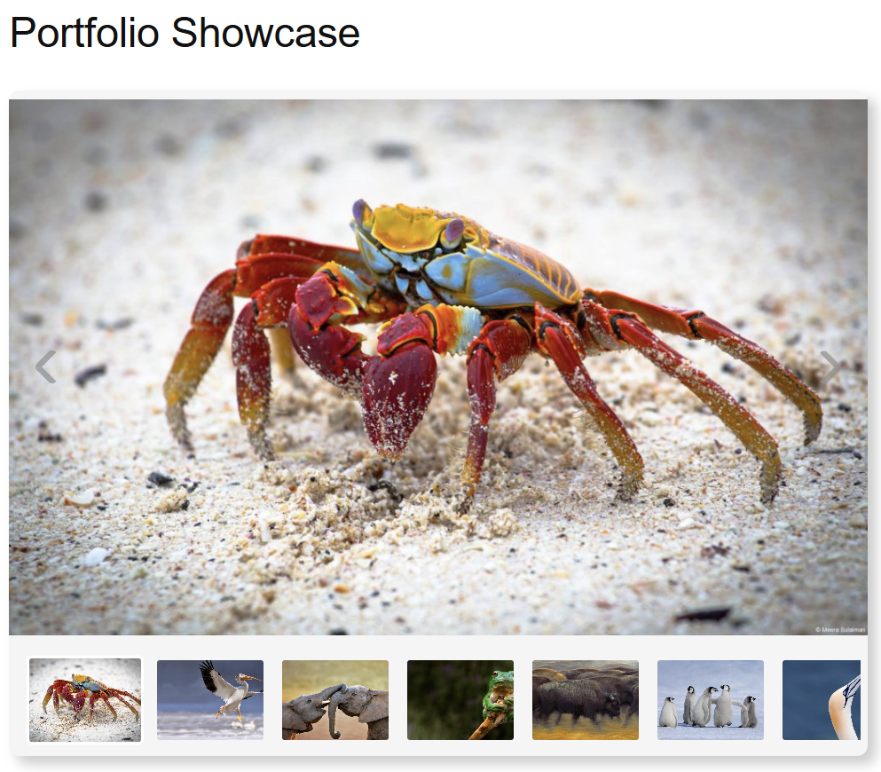
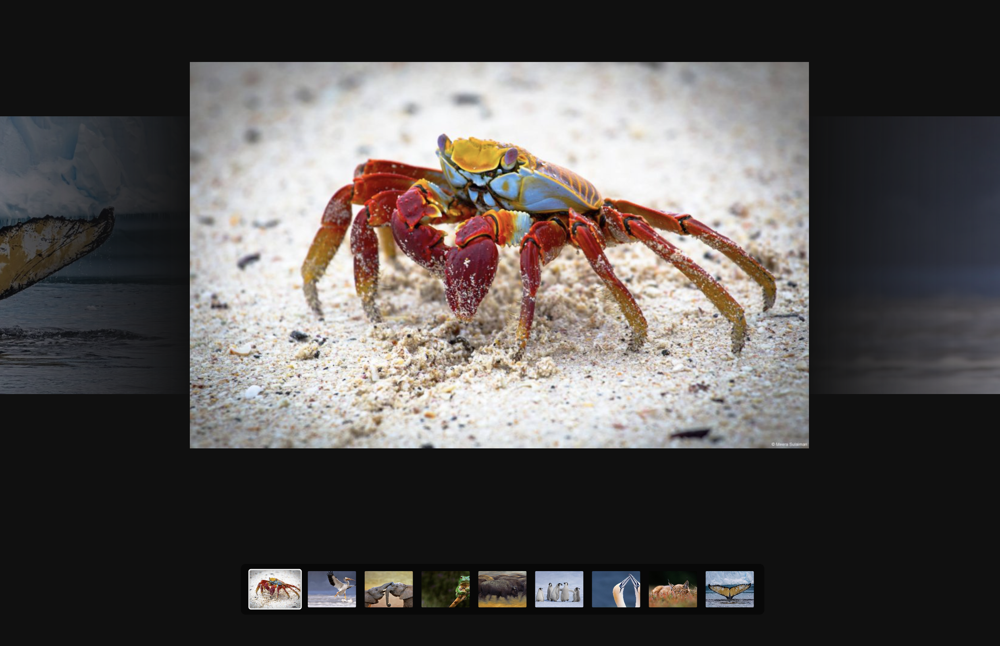
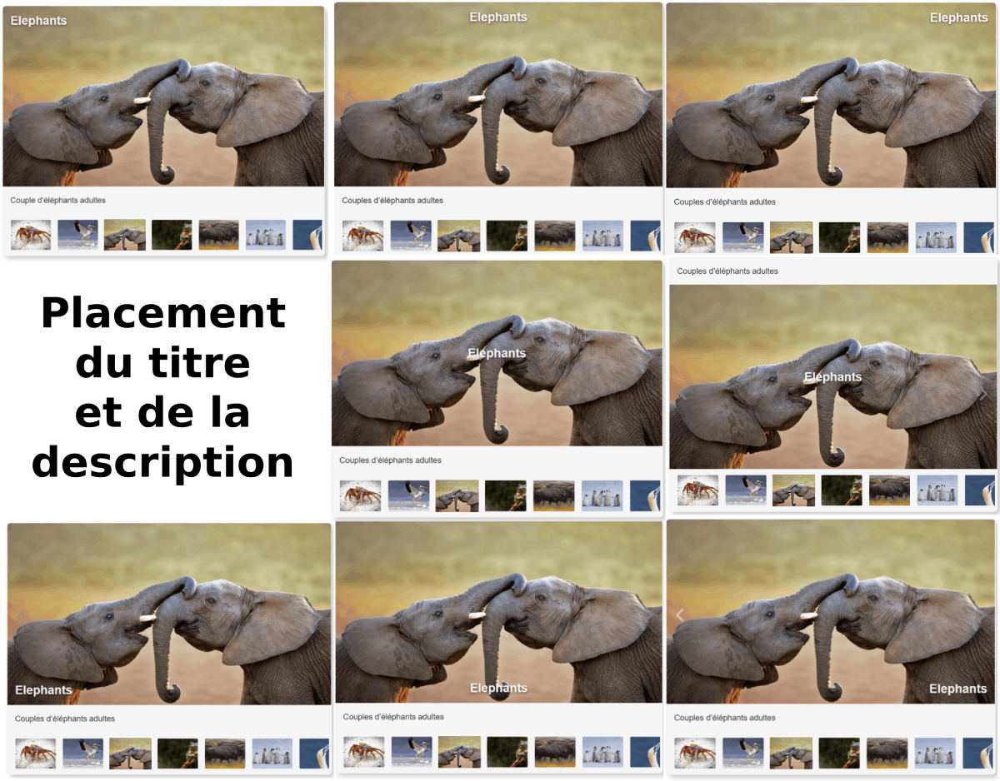
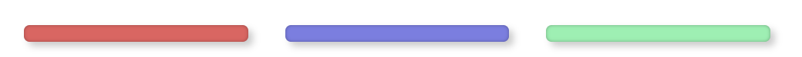
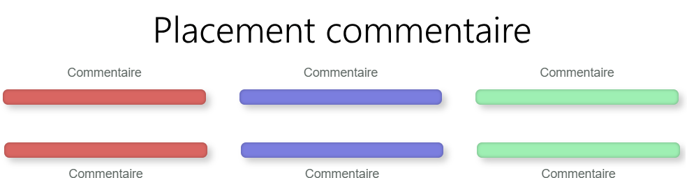
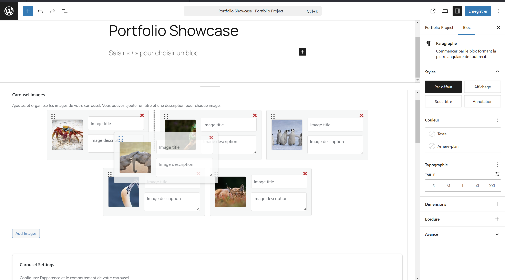
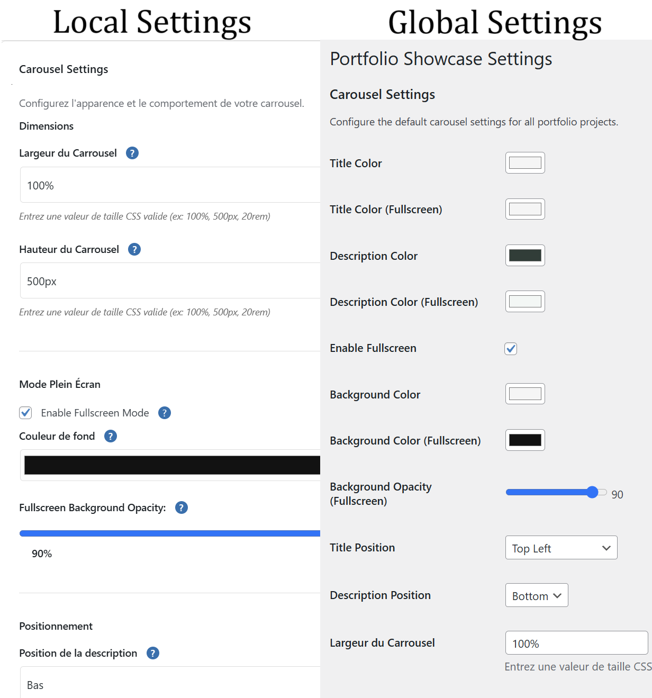

# Portfolio Showcase

Une extension WordPress pour créer et afficher des portfolios avec carrousel d'images et palette de couleurs.

## Version actuelle : 1.0.0 Bêta

Cette version est fonctionnelle mais n'a pas été testée sur un large éventail de configurations WordPress. Vos retours et suggestions sont les bienvenus pour améliorer l'extension.

## Téléchargement

[Télécharger la version 1.0.0 Bêta](https://github.com/votre-nom/portfolio-showcase/releases/latest/download/portfolio-showcase.zip)

## Compatibilité

- WordPress 6.7.2
- PHP 7.4 ou supérieur

## Fonctionnalités

### Carrousel d'images

Le carrousel offre plusieurs fonctionnalités :
- Navigation infinie
- Mode plein écran
- Prévisualisations latérales
- Navigation par miniatures
- Positions de texte personnalisables


*Vue normale du carrousel*


*Mode plein écran*


*Différentes positions possibles pour les titres et descriptions*

### Palette de couleurs

La palette de couleurs permet d'afficher et d'organiser les couleurs de votre projet :


*Affichage de la palette de couleurs*


*Options de placement des commentaires de couleurs*

## Installation

1. Téléchargez l'archive ZIP de l'extension
2. Dans votre administration WordPress, allez dans Extensions > Ajouter
3. Cliquez sur "Téléverser une extension"
4. Sélectionnez le fichier ZIP téléchargé
5. Cliquez sur "Installer maintenant"
6. Activez l'extension

## Utilisation

### Création d'un projet

1. Dans le menu WordPress, cliquez sur "Portfolio Projects"
2. Cliquez sur "Ajouter un Nouveau Projet"
3. Remplissez les informations du projet :
   - Titre et description
   - Images pour le carrousel
   - Couleurs pour la palette
   - Options de style


*Ajout et organisation des images du carrousel*

### Affichage d'un projet

Utilisez le shortcode suivant pour afficher un projet :

```
[portfolio_showcase id="ID_DU_PROJET"]
```

Remplacez `ID_DU_PROJET` par l'ID du projet que vous souhaitez afficher.

## Configuration

### Options globales

Les paramètres globaux sont accessibles dans :
Portfolio > Settings

Vous pouvez y configurer :
- Dimensions par défaut du carrousel
- Couleurs par défaut
- Positions des éléments
- Comportement du mode plein écran


*Comparaison des paramètres globaux et locaux*

### Options par projet

Chaque projet peut avoir ses propres paramètres qui surchargent les paramètres globaux :
- Carrousel : dimensions, couleurs, positions
- Palette de couleurs : couleurs, commentaires
- Style : positions, opacité

## Traductions

L'extension est traduite en français. Les fichiers de traduction se trouvent dans le dossier `languages/`.

## Licence

Cette extension est distribuée sous licence GPL v2 ou ultérieure. 