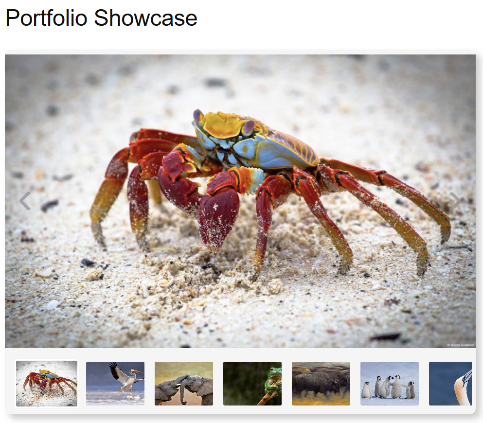
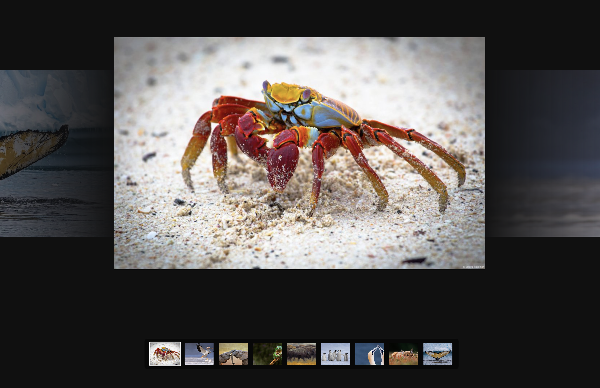
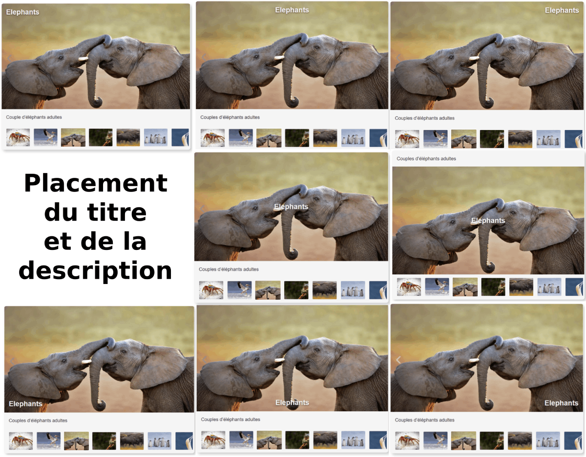
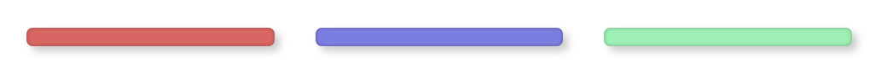
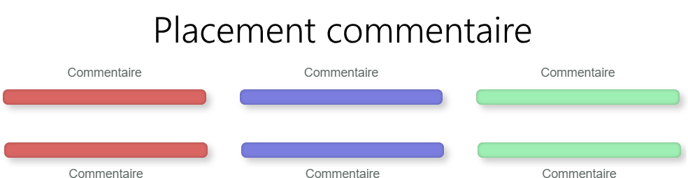
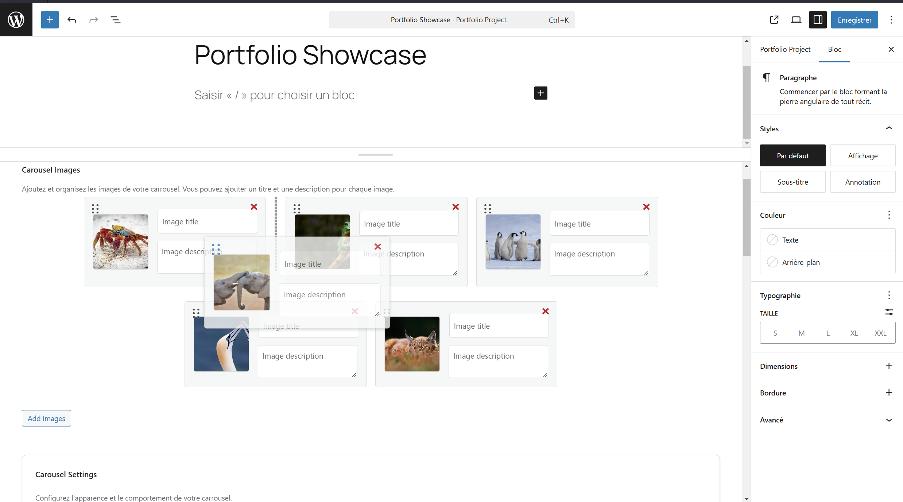
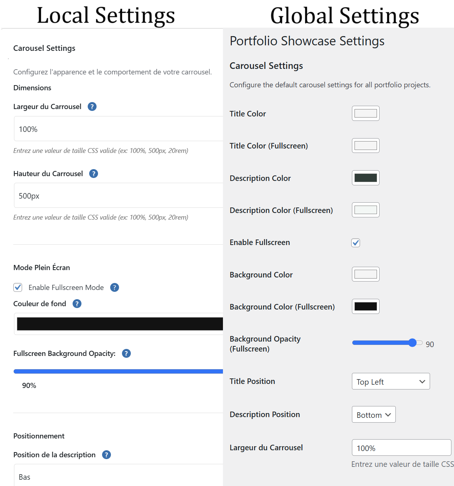

# Portfolio Showcase

Une extension WordPress pour créer et afficher des portfolios avec carrousel d'images et palette de couleurs.

## Version actuelle : 1.0.0 Bêta

Cette version est fonctionnelle mais n'a pas été testée sur un large éventail de configurations WordPress. Vos retours et suggestions sont les bienvenus pour améliorer l'extension.

## Téléchargement

[Télécharger la version 1.0.0 Bêta](https://github.com/SamGoodwater/portfolio-showcase-WP/blob/main/portfolio-showcase.zip)

## Compatibilité

- WordPress 6.7.2
- PHP 7.4 ou supérieur

## Fonctionnalités

### Contrôle de la visibilité et ouverture plein écran par classe
- Vous pouvez choisir d'afficher ou non chaque portfolio (option globale ou locale)
- Vous pouvez activer l'ouverture du portfolio en plein écran via une classe CSS spécifique (option globale ou locale)
- Si le portfolio est masqué, il peut tout de même être ouvert en plein écran via un déclencheur externe

### Carrousel d'images

Le carrousel offre plusieurs fonctionnalités :
- Navigation infinie
- Mode plein écran
- Prévisualisations latérales
- Navigation par miniatures
- Positions de texte personnalisables


*Vue normale du carrousel*


*Mode plein écran*


*Différentes positions possibles pour les titres et descriptions*

### Palette de couleurs

La palette de couleurs permet d'afficher et d'organiser les couleurs de votre projet :


*Affichage de la palette de couleurs*


*Options de placement des commentaires de couleurs*

## Utilisation

### Contrôle de la visibilité
- Dans les réglages globaux (Portfolio > Settings), cochez ou décochez "Afficher ce portfolio par défaut" pour définir la visibilité par défaut de tous les portfolios.
- Dans chaque projet, vous pouvez surcharger ce paramètre dans la metabox "Carrousel" avec "Afficher ce portfolio".

### Ouverture plein écran via une classe CSS
- Activez l'option "Activer l'ouverture en plein écran pour la classe open-portfolio-{ID}" (global ou local)
- Ajoutez un élément HTML avec la classe `open-portfolio-XX` (où XX est l'ID du projet portfolio)
- Un clic sur cet élément ouvrira le portfolio correspondant en plein écran, même s'il est masqué

#### Exemple d'utilisation HTML :
```html
<button class="open-portfolio-123">Voir le portfolio en plein écran</button>
```

Remplacez 123 par l'ID de votre projet.

### Création d'un projet

1. Dans le menu WordPress, cliquez sur "Portfolio Projects"
2. Cliquez sur "Ajouter un Nouveau Projet"
3. Remplissez les informations du projet :
   - Titre et description
   - Images pour le carrousel
   - Couleurs pour la palette
   - Options de style


*Ajout et organisation des images du carrousel*

### Affichage d'un projet

Utilisez le shortcode suivant pour afficher un projet :

```
[portfolio_showcase id="ID_DU_PROJET"]
```

Remplacez `ID_DU_PROJET` par l'ID du projet que vous souhaitez afficher.

## Configuration

### Options globales

Les paramètres globaux sont accessibles dans :
Portfolio > Settings

Vous pouvez y configurer :
- Dimensions par défaut du carrousel
- Couleurs par défaut
- Positions des éléments
- Comportement du mode plein écran
- Afficher ce portfolio par défaut : contrôle la visibilité initiale de tous les portfolios
- Activer l'ouverture en plein écran pour la classe open-portfolio-{ID} : permet d'ouvrir un portfolio masqué via un déclencheur externe


*Comparaison des paramètres globaux et locaux*

### Options par projet

Chaque projet peut avoir ses propres paramètres qui surchargent les paramètres globaux :
- Carrousel : dimensions, couleurs, positions
- Palette de couleurs : couleurs, commentaires
- Style : positions, opacité
- Afficher ce portfolio : contrôle la visibilité de ce projet uniquement
- Activer l'ouverture en plein écran pour la classe open-portfolio-{ID} : permet d'ouvrir ce projet via un déclencheur externe

## Traductions

L'extension est traduite en français. Les fichiers de traduction se trouvent dans le dossier `languages/`.

## Licence

Cette extension est distribuée sous licence GPL v2 ou ultérieure. 